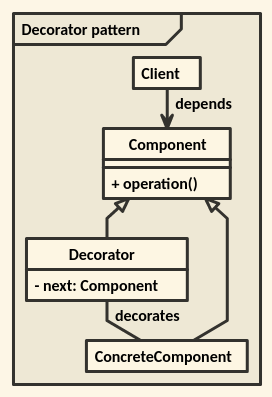
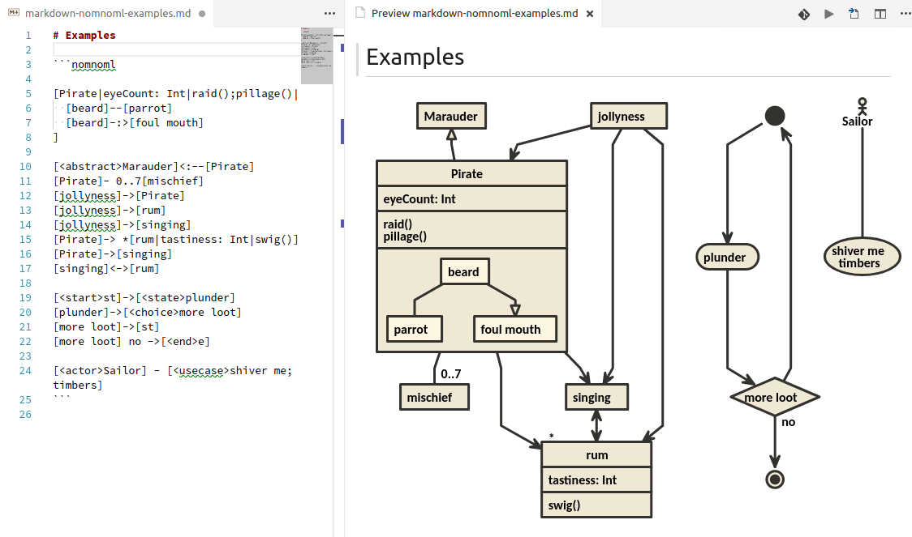
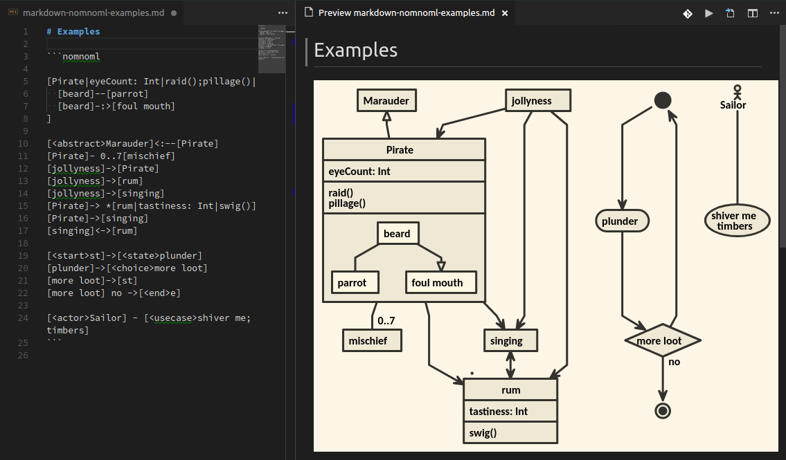
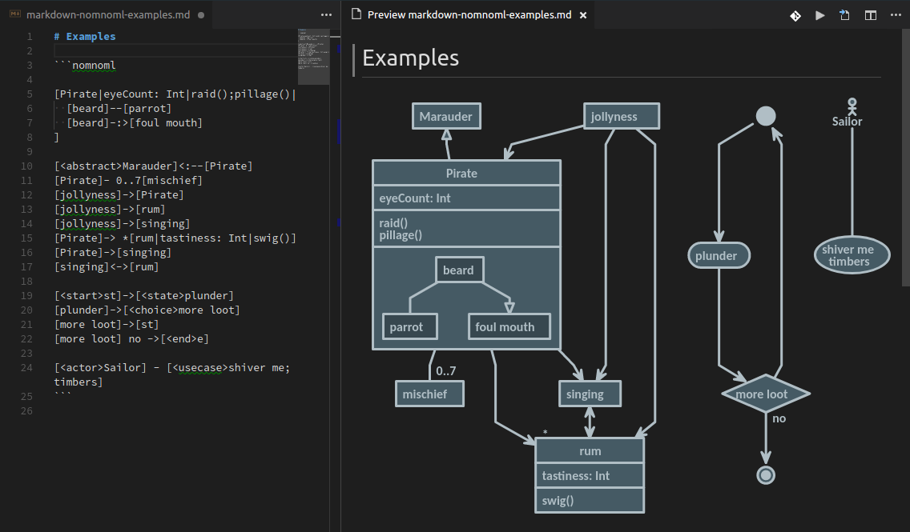

# markdown-nomnoml README

[](https://vsmarketplacebadge.apphb.com/version/amoosbr.markdown-nomnoml.svg)

This extension adds nomnoml uml diagram support to Visual Studio Code's built-in Markdown preview.
Nomnoml provides a way for drawing UML diagrams based on a simple syntax.
You can get a quick overview and play with nomnoml on the [nomnoml.com](http://nomnoml.com/) website.

This extension was made possible by the following projects:

* [nomnoml](https://github.com/skanaar/nomnoml) ([MIT](https://github.com/skanaar/nomnoml/blob/master/LICENSE)) for the awesome uml diagram support
* [markdown-it-nomnoml](https://github.com/tonykero/markdown-it-nomnoml) ([MIT](https://github.com/tonykero/markdown-it-nomnoml/blob/master/LICENSE)) as basis for the modified markdown-it plugin code used in this extension
* [markdown-it-fence](https://github.com/geekplux/markdown-it-fence) ([MIT](https://github.com/geekplux/markdown-it-fence/blob/master/LICENSE)) to easily add a custom markdown-it code fence plugin
* [vscode-nomnoml](https://github.com/doctorrustynelson/vscode-nomnoml) ([MIT](https://github.com/doctorrustynelson/vscode-nomnoml/blob/master/LICENSE)) for the background color setting.

## Features

With the extension you can add `nomnoml` code blocks to your markdown documents. These code blocks are rendered to uml diagrams in VS Code's built-in markdown preview.

The nomnoml code block

    ```nomnoml
    [<frame>Decorator pattern|
      [<abstract>Component||+ operation()]
      [Client] depends --> [Component]
      [Decorator|- next: Component]
      [Decorator] decorates -- [ConcreteComponent]
      [Component] <:- [Decorator]
      [Component] <:- [ConcreteComponent]
    ]
    ```
is rendered as



### Default look on light VS Code theme



### Default look on dark VS Code theme



## Extension Settings

Via the following extension settings, you can customize the default nomnoml style.

* `markdown-nomnoml.style.defaultBackgroundColor`: set the default background color
  * Example values: `#fff` or `transparent`
* `markdown-nomnoml.style.defaultStrokeAndTextColor`: set the default stroke and text color
  * Example values: `#000` or `red`
* `markdown-nomnoml.style.defaultShapeColor`: set the default shape and inner shape color
  * **Note:** Shape and Inner shape color are separated by a colon. Providing only one color code will set shape and inner shape to the same color.
  * Example values: `blue` (shapes and inner shapes set to `blue`), `#fff; #f00` (shapes set to `white` and inner shapes to `red`)

### Custom look using extension settings

Setting the following user settings,

    "markdown-nomnoml.style.defaultBackgroundColor": "transparent",
    "markdown-nomnoml.style.defaultStrokeAndTextColor": "#B0BEC5",
    "markdown-nomnoml.style.defaultShapeColor": "#455A64; #37474F"

will give you the following custom look



## Nomnoml Syntax

nomnoml syntax documentation copied from [nomnoml README](https://github.com/skanaar/nomnoml/blob/master/README.md)

### Association Types

    -    association
    ->   association
    <->  association
    -->  dependency
    <--> dependency
    -:>  generalization
    <:-  generalization
    --:> implementation
    <:-- implementation
    +-   composition
    +->  composition
    o-   aggregation
    o->  aggregation
    --   note
    -/-  hidden
    _>   weightless edge
    __   weightless dashed edge

### Classifier Types

    [name]
    [<abstract> name]
    [<instance> name]
    [<reference> name]
    [<note> name]
    [<package> name]
    [<frame> name]
    [<database> name]
    [<start> name]
    [<end> name]
    [<state> name]
    [<choice> name]
    [<input> name]
    [<sender> name]
    [<receiver> name]
    [<transceiver> name]
    [<actor> name]
    [<usecase> name]
    [<label> name]
    [<hidden> name]
    [<table> name| a | 5 || b | 7]

### Directives

    #arrowSize: 1
    #bendSize: 0.3
    #direction: down | right
    #gutter: 5
    #edgeMargin: 0
    #gravity: 1
    #edges: hard | rounded
    #background: transparent
    #fill: #eee8d5; #fdf6e3
    #fillArrows: false
    #font: Calibri
    #fontSize: 12
    #leading: 1.25
    #lineWidth: 3
    #padding: 8
    #spacing: 40
    #stroke: #33322E
    #title: filename
    #zoom: 1
    #acyclicer: greedy
    #ranker: network-simplex | tight-tree | longest-path

### Custom Classifier Styles

A directive that starts with "." define a classifier style. The style is written as a space separated list of modifiers and key/value pairs.

    #.box: fill=#8f8 dashed
    #.blob: visual=ellipse
    [<box> GreenBox]
    [<blob> HideousBlob]

Available key/value pairs are

    fill=(any css color)

    stroke=(any css color)

    align=center
    align=left

    direction=right
    direction=down

    visual=actor
    visual=class
    visual=database
    visual=ellipse
    visual=end
    visual=frame
    visual=hidden
    visual=input
    visual=none
    visual=note
    visual=package
    visual=receiver
    visual=rhomb
    visual=roundrect
    visual=sender
    visual=start
    visual=table
    visual=transceiver

Available modifiers are

    bold
    underline
    italic
    dashed
    empty


## Known Issues

* The `import` directive doesn't seem to work

## Release Notes

## 0.0.3

Support nomnoml tables, weightless edges, `gravity`, `acyclicer` and `ranker` directives. Support all documented modifiers (`bold, underline, italic, dashed, empty`).

## 0.0.2

Two defects related to markdown preview fixed.

### 0.0.1

Initial release of markdown-nomnoml adding nomnoml uml diagram support to VS Code's built-in markdown preview. Supporting custom default background, stroke, shape, and text colors.
